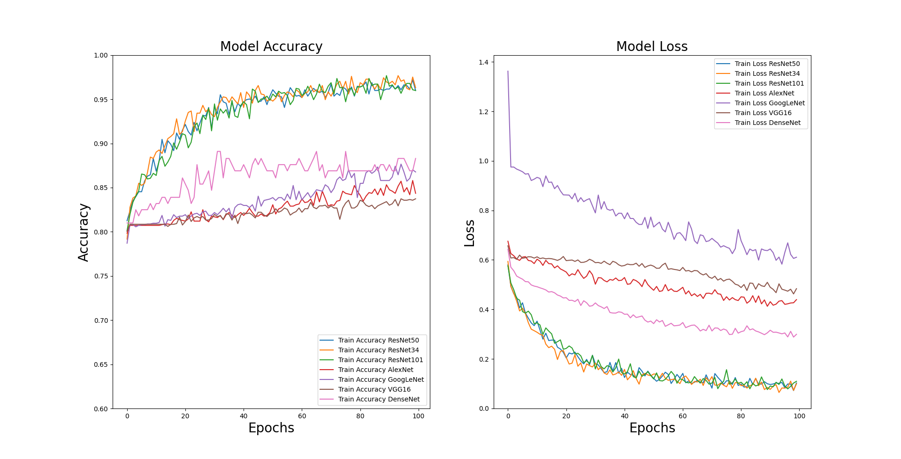
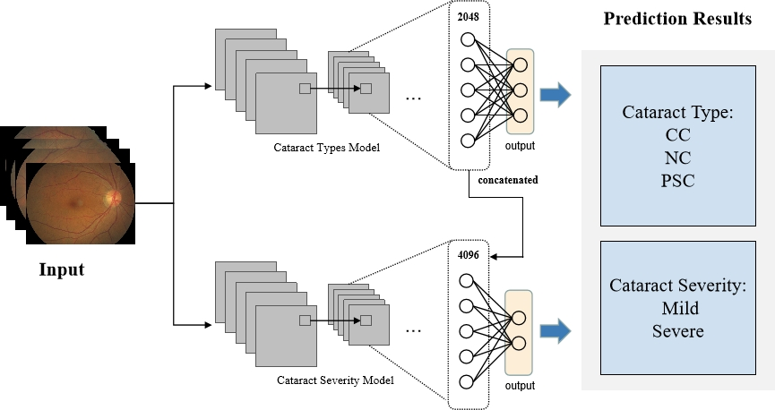
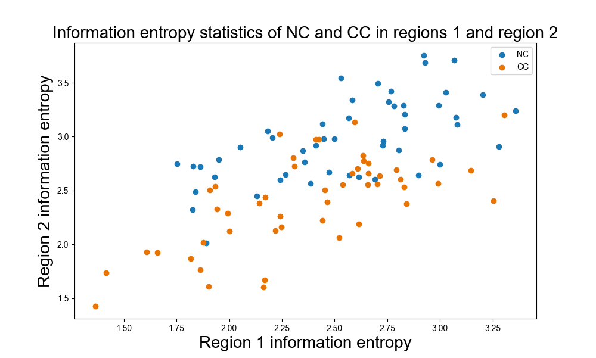
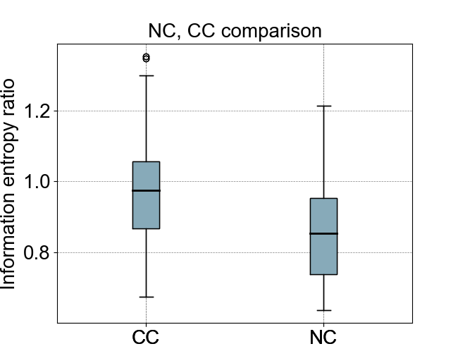
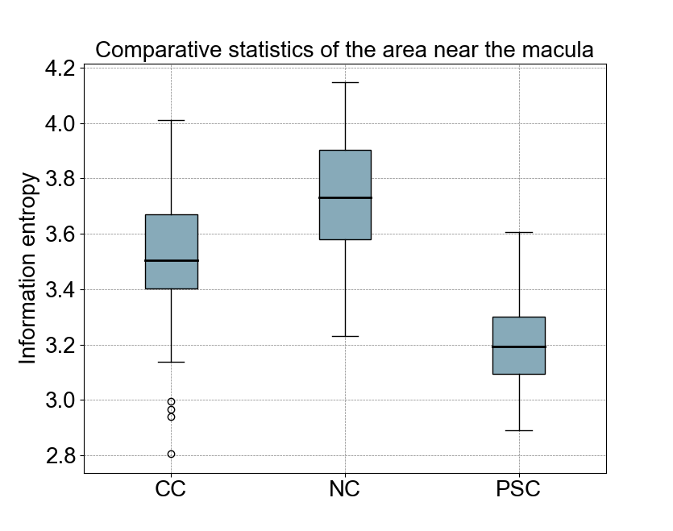
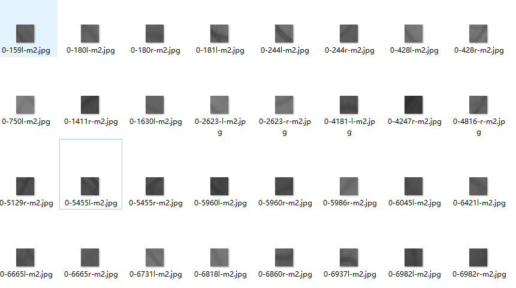

# Dual_Stream_Cataract_Evaluation_Network

Cataracts were classified into three types based on the location of the lens opacity: cortical cataract, nuclear cataract, and posterior subcapsular cataract. We developed a Dual-Stream Cataract Evaluation Network (DCEN) that uses color photographs of cataract fundus to achieve simultaneous cataract type classification and severity grading. The accuracy of severity grading was enhanced by incorporating the results of type classification. 

Based on the type and severity of cataract, the patient's ability to perform vision-related tasks is affected differently, and the timing and method of surgery vary. Therefore, individualized assessment and management of cataract patients are necessary. Different clinical cataract classification standards have been introduced independently based on these cataract types. Lens Opacities Classification System III and other systems separately assess the severity of three different types based on slit-lamp and retro-illumination images. However, manually identifying cataract types and severity can be time-consuming, especially in places without enough experienced medical power.

Our Framework:

Step 1:

We utilized 1,340 color fundus photographs from 875 participants (aged 50-91 years at image capture) from the Beijing Eye Study 2011. Four experienced and trained ophthalmologists performed the classification of these cases based on slit-lamp and retro-illuminated images. 

train50_Step1_cataractTypes.py

Firstly, we attempted to identify three different types of cataracts through fundus images using different backbone networks, and found that the resnet based method has good performance. We obtained ACC of 0.9762 and F1 of 0.9401 in the validation set

This is the training process for cataract type classification under different backbone networks:

| Method     | ACC     | Sen    | F1     | Kappa   |
|------------|---------|--------|--------|---------|
| VGG-16     | 0.7547  | 0.5769 | 0.3174 | 0.1084  |
| AlexNet    | 0.8832  | 0.5356 | 0.5222 | 0.2549  |
| GoogLeNet  | 0.9058  | 0.5801 | 0.6445 | 0.3221  |
| DenseNet   | 0.9504  | 0.8502 | 0.8813 | 0.7090  |
| ResNet34   | 0.9604  | 0.9158 | 0.8103 | 0.8168  |
| ResNet101  | 0.9653  | 0.9720 | 0.9374 | 0.8382  |
| ResNet50   | 0.9762  | 0.9820 | 0.9401 | 0.8619  |

Step 2:

train50_Step2_DCEN.py

Then we lock in the parameters and retrain the training set to perform mill and sever binary classification on the cataract fundus images from the training and validation sets.

By adopting three different data fusion schemes: resnet50_ Mean_ Aggregation resnet50_ Dim_ Reduction resnet50_ Threshold_ Reduction

ALL have achieved better performance compared to other solutions

| Method         | ACC     | Sen    | F1     | Kappa   |
|----------------|---------|--------|--------|---------|
| ResNet50       | 0.8173  | 0.6330 | 0.6570 | 0.3390  |
| SE-ResNet50    | 0.8290  | 0.7085 | 0.7298 | 0.4626  |
| BAM-ResNet50   | 0.7992  | 0.7140 | 0.7138 | 0.4276  |
| CBAM-ResNet50  | 0.7806  | 0.5280 | 0.4971 | 0.0821  |
| DCEN (ours)    | 0.9703  | 0.9344 | 0.9555 | 0.9111  |

If we use the type of cataract as an auxiliary signal or attention, this prior knowledge based approach will greatly outperform other ATT mechanisms.

In addition, we found and summarized the fundus characteristics of three different cataracts through thermal maps:

1. The blurred area of NC spreads from the optic disc towards the nasal side in the fundus image.
2. The blurred area of CC extends from the periphery towards the center of the fundus image.
3. The blurring of PSC occurs around the macula.

Please refer to our research article for more information

Cataract patients may also suffer from other blinding eye diseases, so ophthalmologists have to diagnose them before surgery. The cloudy lens in cataract patients causes a hazy degeneration in the fundus image, making it challenging to observe the patient's retinal vessels. This poses difficulties for ophthalmologists in their work. Previous researchers have proposed different methods to enhance fundus images of cataract patients. However, these works did not consider the fuzzy characteristics of different types and degrees of cataracts.

## environment
* Python 3.8.12
* VS Code
* pytorch 1.10 (pip package)
* torchvision 0.11.1 (pip package)

